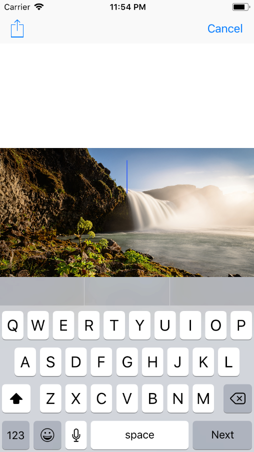

# MemeMe (2/5)

This is the second part of a five part series of sample apps created for [Udacity's Nanodegree "Become an iOS Developer"](https://udacity.com/course/ios-developer-nanodegree--nd003).

With MemeMe you can choose an image from your device internal gallery and add a typicel "Meme" text to it. Afterwards
you can share your created meme with external apps. All shared "Memes" are displayed in a _UITableView_ and a _UICollectionView_.

Learning goal of this app was to deepen the understanding of UIKit components. This includes:

* The usage of pre-made system controllers like _UIImagePickerController_ or _UIActivityViewController_
* Little tweaks to enhance the user experience. (e.g.: making sure that the picture is not obscured by the keyboard)

## Screenshots
  

## Getting Started

These instructions will get you a copy of the project up and running on your local machine for development and testing purposes.

### Prerequisites

* XCode version that is capable of supporting Swift 4.0

## Built With

_There were no external libraries used for this project._

## Authors

* **Niklas Rammerstorfer** - *Initial work* - [Shanakor](https://github.com/Shanakor)
